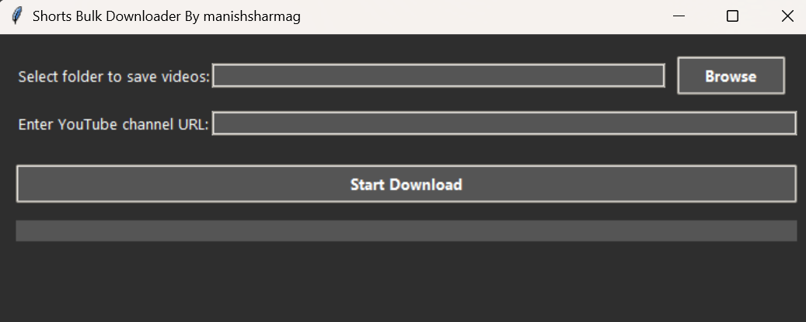

# 🎬 YouTube Shorts Downloader

A fast and simple GUI tool to **bulk download YouTube Shorts** from any public channel using Python and `yt-dlp`.  
Easily save hundreds of Shorts videos to your local folder — automatically and efficiently.

---

## 🚀 Features

- 🔗 Auto-detects and fetches all Shorts from any YouTube channel
- ⏬ Downloads in **best available quality** (video + audio merged)
- 📊 Real-time progress:
  - Shows each video’s download percentage
  - Displays “X of Y downloaded” counter
- 🧵 Downloads **3–5 videos in parallel** for speed
- 🪟 Beautiful and responsive GUI built with `Tkinter`

---

## 📸 App Preview
 
> Example:
> 

---

## 📦 Requirements

- Python 3.8 or higher
- Modules:
  - `tk`
  - `ttkthemes`
  - `yt-dlp`

---

## 🛠️ Installation

1. Clone the repository:
   ```bash
   git clone https://github.com/your-username/youtube-shorts-downloader.git
   cd youtube-shorts-downloader
   
pip install -r requirements.txt
